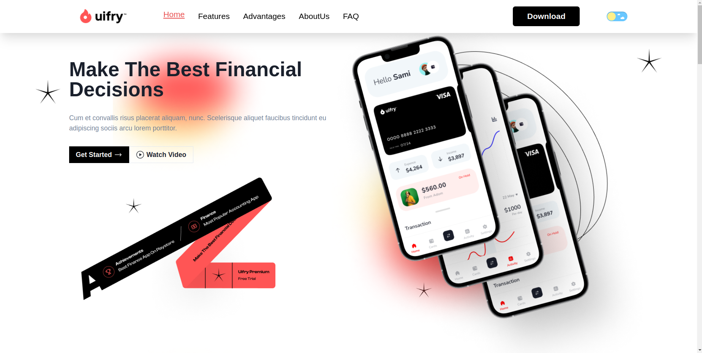
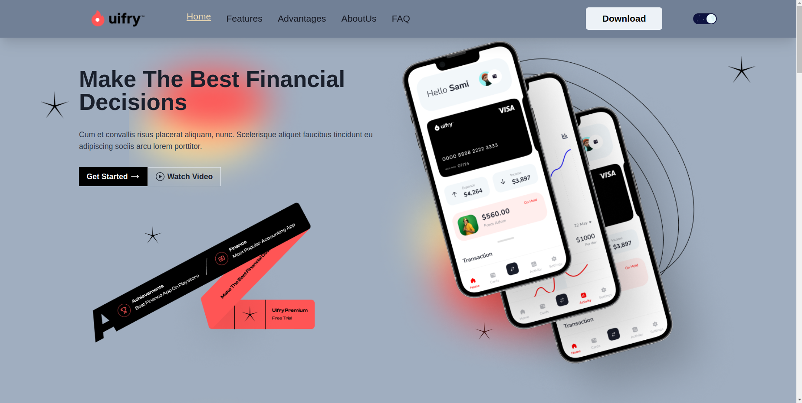

# UrFry

UrFry is a single landing page application with smooth scrolling effects, developed using HTML, CSS, JavaScript, React, and Chakra UI. It features sections such as Home, Features, Advantages, About Us, and FAQs. The smooth scrolling effect is implemented using the `react-scroll` library.

## Table of Contents
- [Features](#features)
- [Installation](#installation)
- [Usage](#usage)
- [Technologies Used](#technologies-used)
- [Screenshots](#screenshots)

## Features
- Home section with an overview of the product
- Features section detailing the key functionalities
- Advantages section highlighting the benefits
- About Us section with information about the creators
- FAQs section addressing common questions
- Smooth scrolling effect for navigation

## Installation

To get started with the project, follow these steps:

1. Clone the repository:
    ```bash
    git clone https://github.com/mYashavanth/uifry.git
    ```
2. Navigate to the project directory:
    ```bash
    cd uifry
    ```
3. Install the dependencies:
    ```bash
    npm install
    ```

## Usage

To run the project locally, use the following command:
    ```bash
    npm run dev
    ```

This will start the development server. Open your browser and navigate to `http://localhost:5173` to view the application.

You can also view the deployed application [here](https://uifry-pied-two.vercel.app/).

## Technologies Used

- HTML
- CSS
- JavaScript
- React
- Context-API
- Chakra UI
- React Scroll
- React Icons
- React Dark Mode Toggle

## Screenshots

### Screenshot 1


### Screenshot 2


### Screenshot 3


### Screenshot 4


